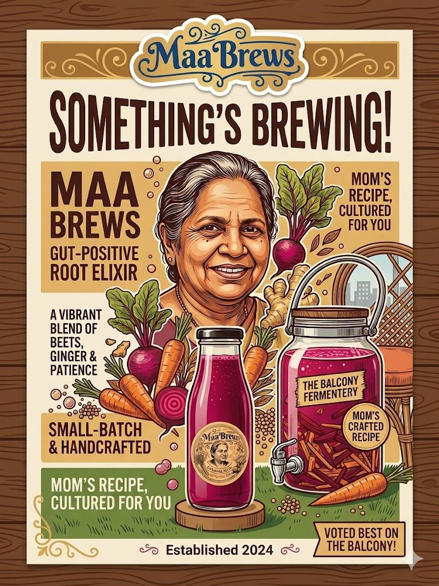
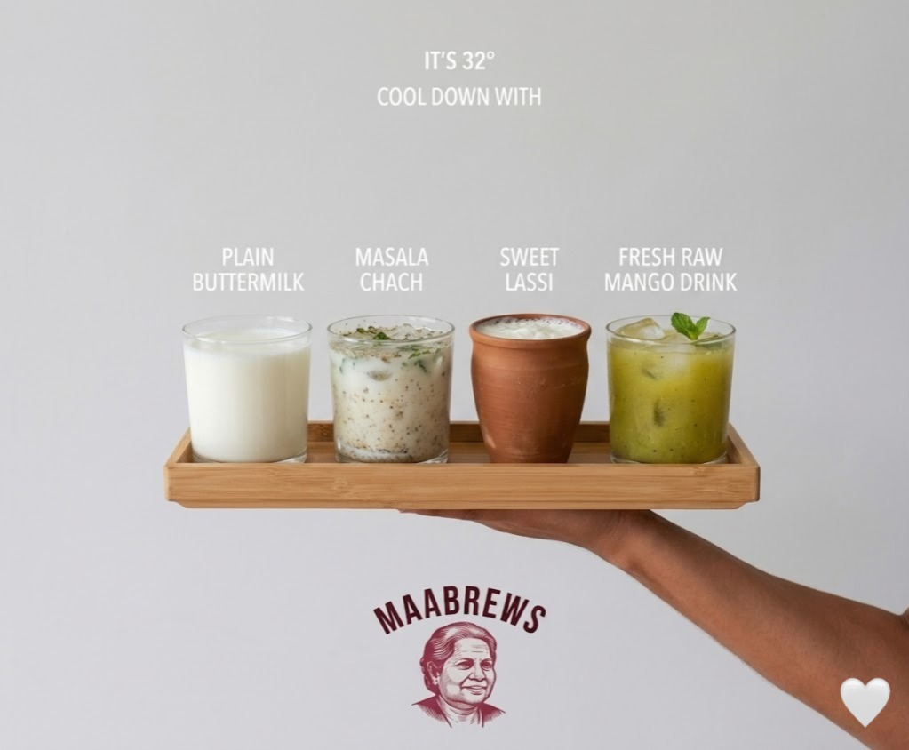
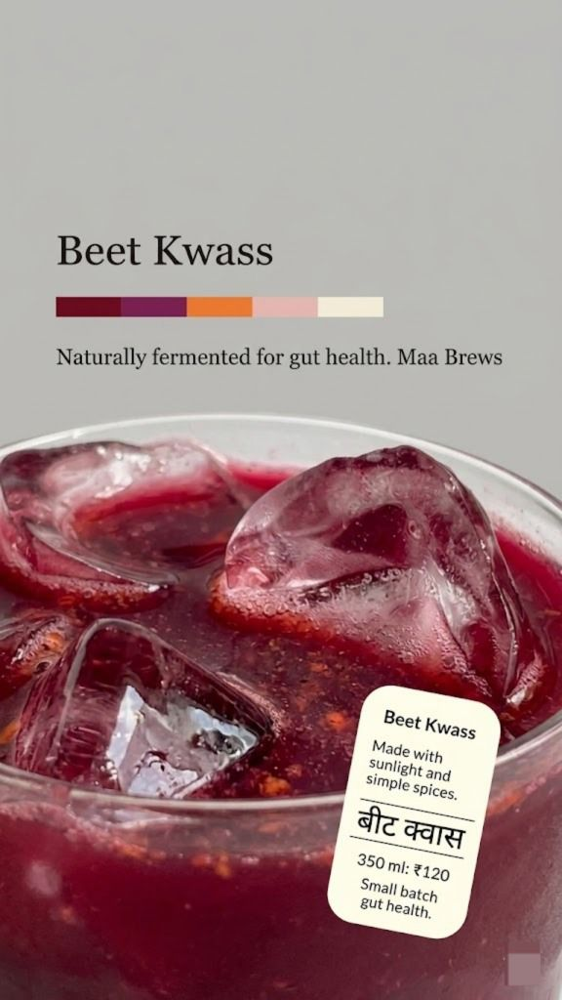
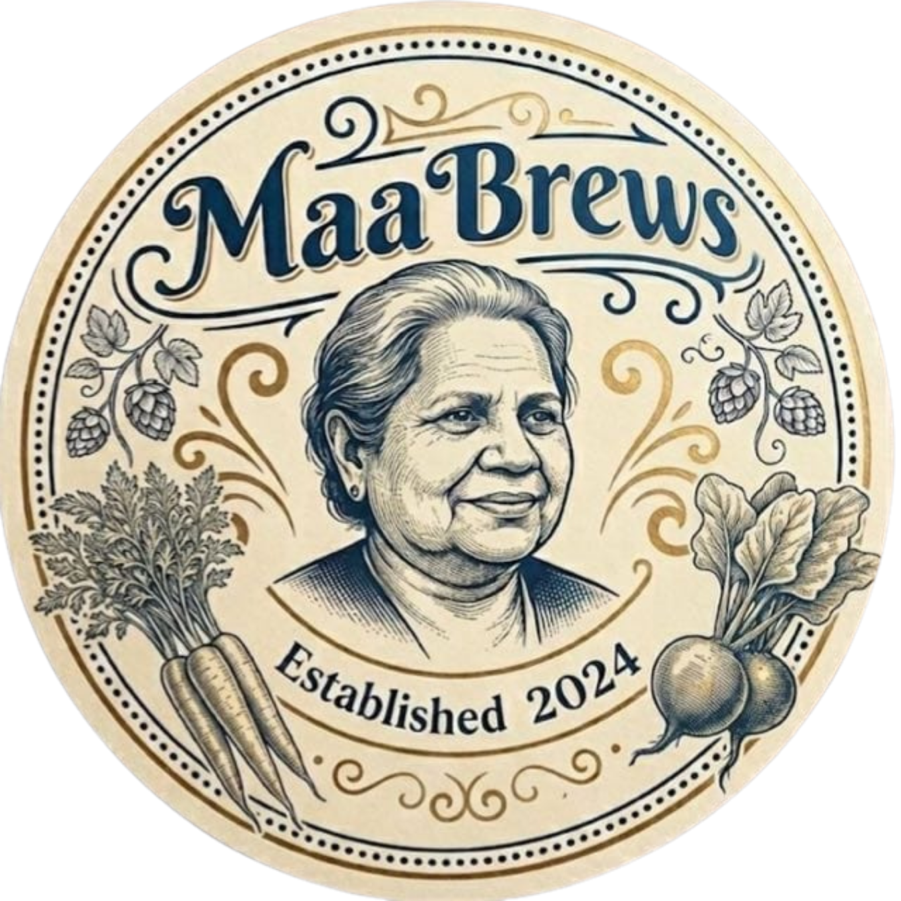

# Maa Brews



**From my mother, to me, and now to you.**

Fresh homemade summer drinks, small-batch and naturally fermented on the balcony. No preservatives. No artificial colours. Just probiotic goodness made with Maa's special recipe.

[maabrews.com](https://maabrews.com)

---

## The Menu

| Drink | Size | Price |
|-------|------|-------|
| Kanji (कांजी) | 300ml | ₹100 |
| Beet Kwass (बीट क्वास) | 350ml | ₹120 |
| Plain Buttermilk (सादा छाछ) | 300ml | ₹50 |
| Masala Chaas (मसाला छाछ) | 300ml | ₹60 |
| Sweet Lassi (मीठी लस्सी) | 300ml | ₹70 |
| Fresh Raw Mango Drink (कच्चा आम पन्ना) | 300ml | ₹70 |

Return your Kanji or Beet Kwass bottles and get ₹10 off your next order.



## How It Works

1. Browse the menu at [maabrews.com](https://maabrews.com)
2. Add drinks to your tray
3. Hit **Order on WhatsApp** — your order is sent as a message to Maa
4. She confirms availability and delivery

## The Stack

Single-page static site. No build step.

- **Vue 3** (CDN) — cart state and reactivity
- **Tailwind CSS** (CDN) — styling
- **WhatsApp API** — checkout sends a pre-filled DM

```
index.html    ← markup + layout
script.js     ← Vue app, product data, cart logic
styles.css    ← animations and gallery scroller
images/       ← product photos and branding
videos/       ← fermenting loop
```

### Desktop

Split layout — fixed brand panel on the left, scrollable menu on the right.

### Mobile

Single-column flow with sticky header, sticky category tabs, and a bottom cart bar.



## Running Locally

Serve the directory with any static server:

```sh
python3 -m http.server 8080
# open http://localhost:8080
```

---

Est. 2024 · The Balcony Fermentery


